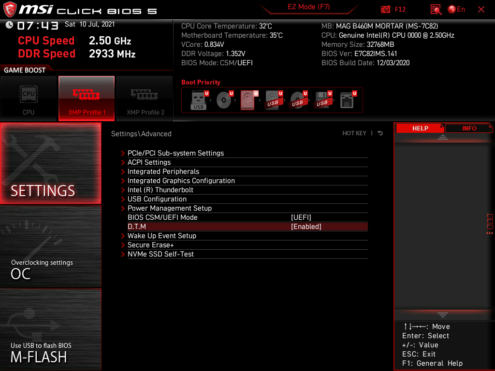
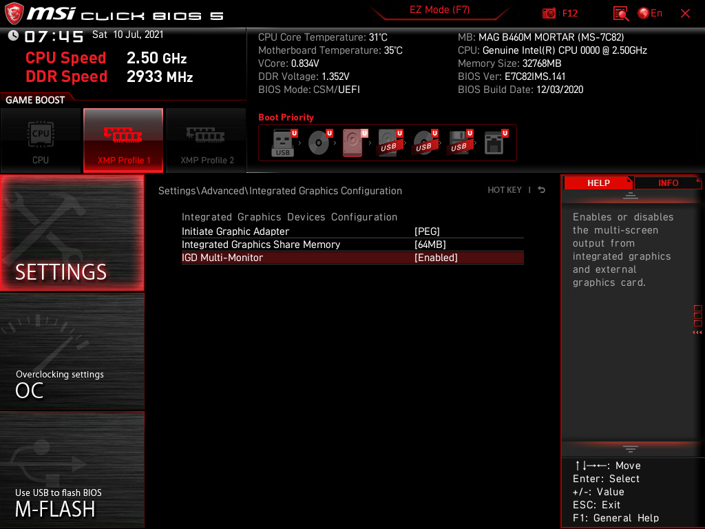
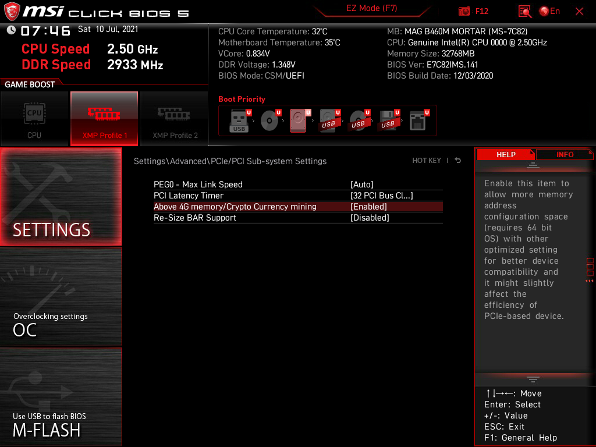
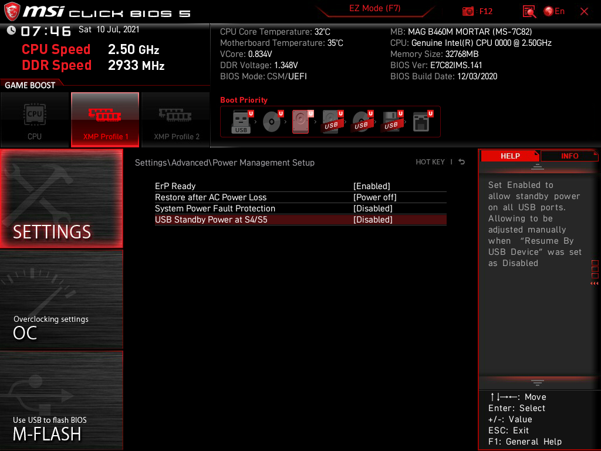
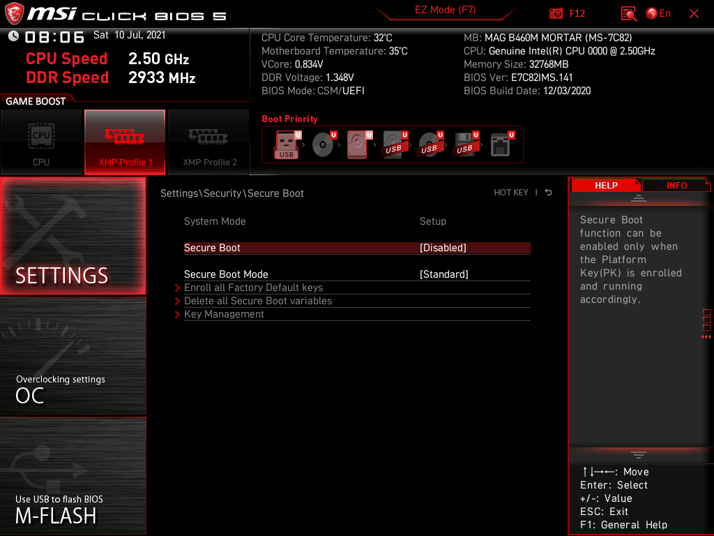
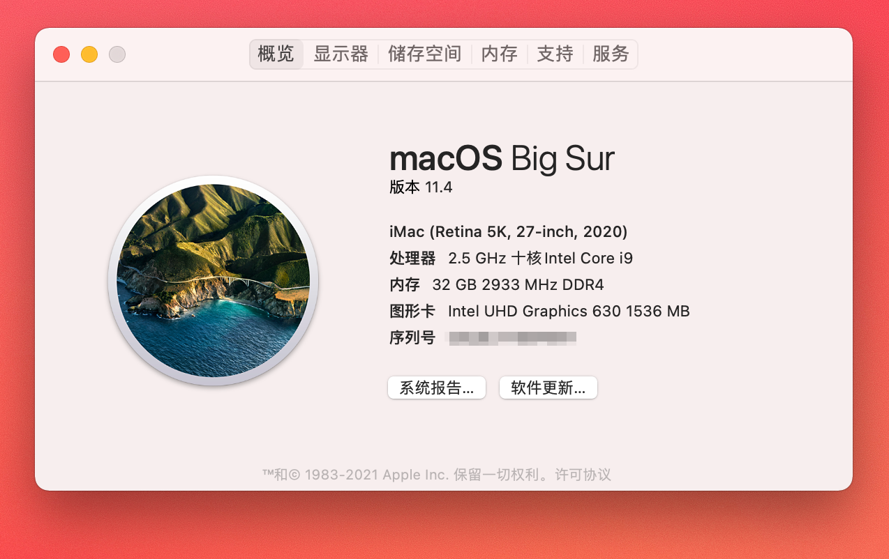
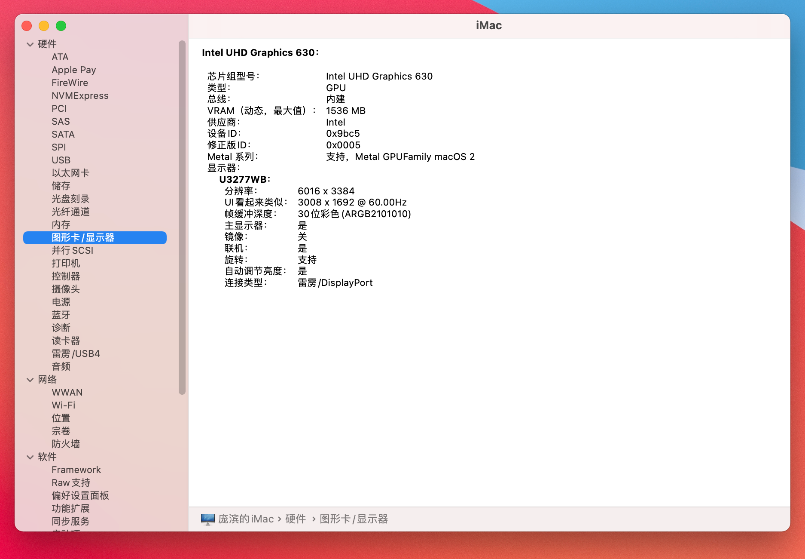
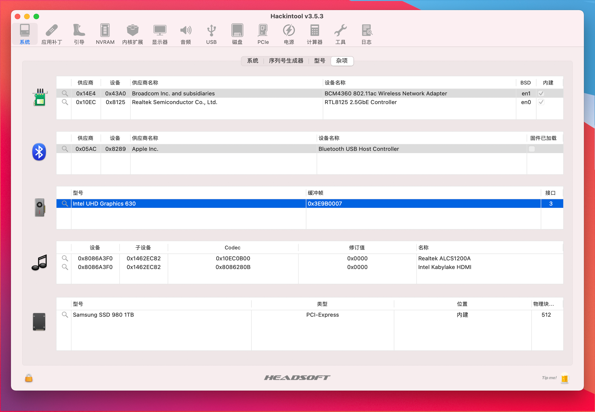
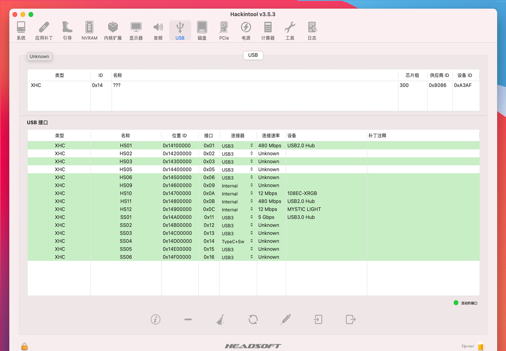

# Hackintosh-10900ES-B460M-MORTAR
Hackintosh OpenCore EFI, i9 10900es, MSI MAGB460M Mortar, iGPU UHD 630, BCM94360CS

男士自用一手 EFI

#### ！！！一定要用 **GenSMBIOS** 生成自己的序列号，替换 cconfig.plist 里的对应内容
#### ！！！一定要用 **GenSMBIOS** 生成自己的序列号，替换 cconfig.plist 里的对应内容
#### ！！！一定要用 **GenSMBIOS** 生成自己的序列号，替换 cconfig.plist 里的对应内容

## 重要问题

### 1.打开XMP以后，偶尔死机，使用中卡死的问题。

不开**XMP**内存频率只能跑在 `2400`，太不爽了。折腾好几天终于没问题了！！！

需要手工设置内存参数。按以下步骤设置 bios：

- 还原默认设置，重启重新进入bios
- 进入**OC**
- 启用 **XMP**  `Enabled`
- **频率** 根据CPU 设置为  `DDR4-2666` 或者 `DDR4-2933`
- **Memory Try It!**  设置根据内存条可用时序，从后往前选。我这里直接用最慢的 `C16`
- **时序模式** 选择 `未连结`
-  **内存快速启动** 选择 `禁止`
-  **DRAM电压** 设置为 `1.20V`  2666和2933都是这个电压
- 进入 **设置** > **高级** D.M.T 选择  `Enabled`
- **F10** 保存重启

## 电脑信息

|  - | 型号  |
|:----------|:----------|
| CPU      | INTEL i9 10900es (QTB1) |
| 主板      | 微星 MSI B460M Mortar （bios：E7C82IMS.140）  |
| 内存      | 光威 Gloway DDR4 3000MHz TYPE-α 16GB*2    |
| 显卡      | 集成显卡 iGPU UHD 630  |
| 储存      | WD SN750 1T |
| 网卡      | 主板集成 RTL8125 2.5G  |
| 无线网卡   | 苹果免驱 BCM94360CS    |
| 系统      | MocOS big Sur 11.4    |

## EFI

### OpenCore 0.7.1
OpenCore 版本每到 x.x.1 和 x.x.6 会更新 EFI

### MacOS Version
> Big Sur 11.5.1

### 功能
- [x]  睡眠/唤醒（bios关闭usb唤醒，睡眠后用电源键唤醒）
- [x]  定制USB端口（前置USB保留3.0，删除2.0，后面板USB都可用）
- [x]  Airdrop/Handoff/iMessage/
- [x]  核显硬件加速
- [x]  声卡输出
- [x]  以太网
- [x]  蓝牙/WiFi
- [x]  DP 4K输出
- [ ]  Sidecar（没有iPad没测试）

## Tools 工具

- [ProperTree](https://github.com/corpnewt/ProperTree)
- [GenSMBIOS](https://github.com/corpnewt/GenSMBIOS)
	- 选择 iMac20,1 SMBIOS
	- `Type` 复制到 `Generic -> SystemProductName`
	- `Serial` 复制到 `Generic -> SystemSerialNumber`
	- `Board Serial` 复制到 `Generic -> MLB`
	- `SmUUID` 复制到 `Generic -> SystemUUID`
- [Hackintool](https://github.com/headkaze/Hackintool/releases)
	- 黑苹果工具箱

## BIOS 设置

### 版本 7C82v14 

### 一键设置黑苹果
微星 Bios 里有 `D.T.M` 选项，只要打开就回把所有黑果用的设置，设置好。不用在手动一一设置。
 

### 没有 DTM 的按照下面的截图设置

## 安装

- 按照 `OpenCore` 官方的创建USB安装启动器的教程创建USB安装盘
- U盘一定要插在主板背面的 USB2.0上，否则会出现 `安装器已损坏` 或 `无法载入更新` 的错误

## 其它问题

1. 引导界面按空格键可以显示隐藏选项，便于Reset NVRAM等等；
2. 引导界面用Ctrl+回车可以更改默认的引导系统，比如想默认Windows可以把光标停到Win图标按Ctrl+回车；
3. 休眠有问题的，使用Hackintool选择电源选项卡点击下方的螺丝刀图标即可修复；

## 系统截图

